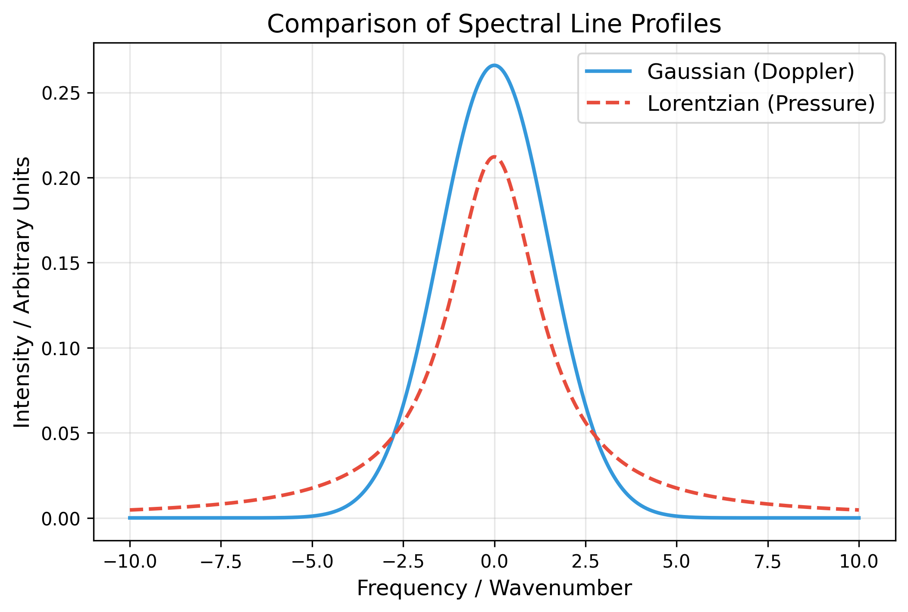

# 第1回: 数式のテスト

サイトの立ち上げと、MathJaxの表示テストです。

## インライン数式
文章の中に数式を埋め込む場合は `$` で囲みます。
光子のエネルギーは $E = h\nu$ で表されます。

## ディスプレイ数式
独立した行として大きく表示する場合は `$$` で囲みます。
時間に依存しないシュレーディンガー方程式は以下の通りです。

$$\hat{H}\psi = E\psi$$

Pythonコードも綺麗に表示されます。

```python
import numpy as np
print("Hello, Spectroscopy!")
```

## スペクトル線形状の比較
ガウス関数（ドップラー広がり）とローレンツ関数（圧力広がり）を比較したグラフです。
<figure markdown="span">
  
  <figcaption>図1：ガウス関数とローレンツ関数の比較（線幅のテイルの違いに注目）</figcaption>
</figure>